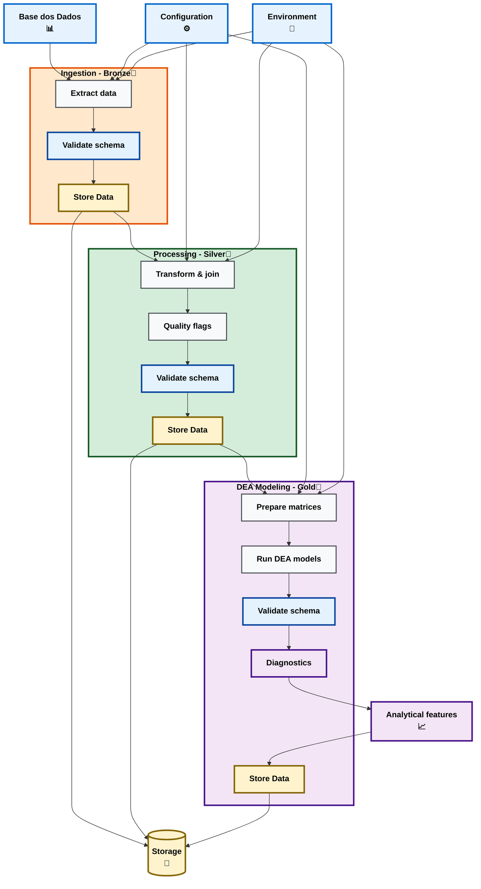

**Alt Text for Diagram:**
"End-to-end data pipeline diagram showing ingestion (Bronze), processing (Silver), and DEA modeling (Gold) layers. Each layer performs extract, transform, validate, and save steps, with configurations, environment variables, and schema validation integrated at each stage. Outputs are stored locally and in Google Cloud Storage and visualized via analytical dashboards."
