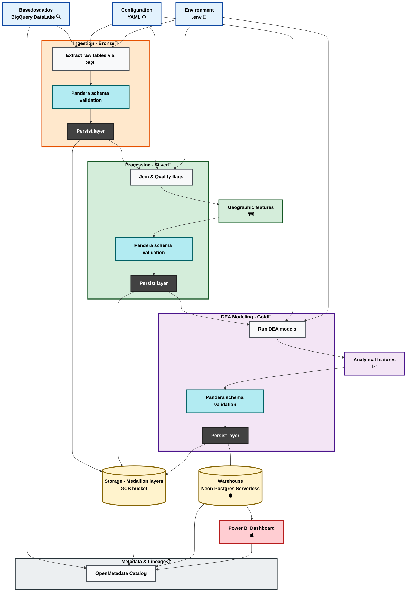

**Alt Text:**
"End-to-end data pipeline architecture diagram. Raw datasets extracted from 'basedosdados' BigQuery datalake and ingested into the Bronze layer of a GCS storage bucket. Data is then processed and validated into the Silver layer, followed by DEA and analytical features modeling in the Gold layer. Final outputs are loaded into a Neon PostgreSQL warehouse for visualization in a Power BI dashboard. Configuration files, environment variables, and schema validation are applied throughout the pipeline, and metadata lineage is tracked using OpenMetadata."

**Texto Alternativo:**
"Diagrama da arquitetura de um pipeline de dados de ponta a ponta. Conjuntos de dados brutos extraídos do datalake BigQuery 'basedosdados' são ingeridos na camada Bronze de armazenamento do GCS. Os dados são então processados ​​e validados na camada Silver, seguidos pela modelagem DEA e recursos analíticos na camada Gold. Os resultados finais são carregados em um warehouse Neon PostgreSQL para visualização em um painel do Power BI. Arquivos de configuração, variáveis ​​de ambiente e validação de esquema são aplicados ao longo de todo o pipeline, e a linhagem de metadados é rastreada usando o OpenMetadata."
